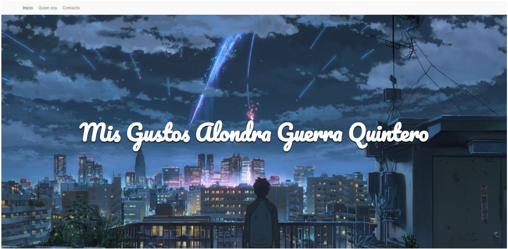
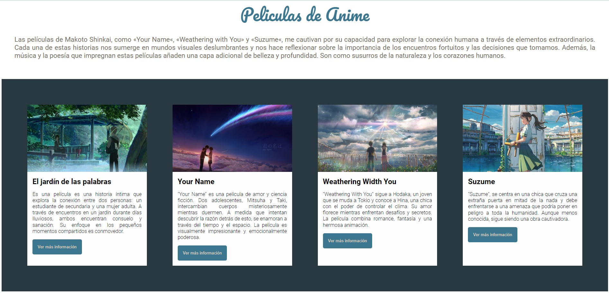
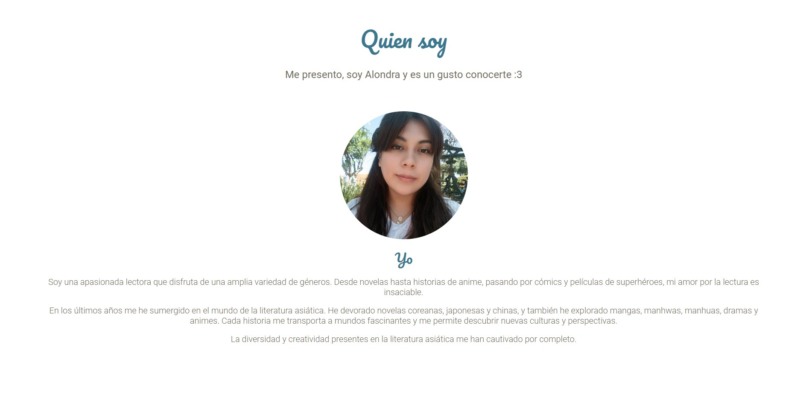

# Mis Gustos Alondra Guerra

El presente proyecto es una página con mis gustos personales desarrollado para el bootcamp de desarrollo frontend de Technolochicas PRO.
Fue desarrollado con HTML, y CSS.

La página es responsiva (adaptable a diferentes tamaños de pantalla).
[Proyecto Desplegado (https://plusalo.github.io/portafolio-b7-g2/)](https://plusalo.github.io/portafolio-b7-g2/)
## Secciones de mi sitio

## Tecnologías
* HTML
* CSS
---
Desarrollado con 💜 por [Alondra](https://github.com/PLUSAlo/portafolio-b7-g2) en [TECHNOLOCHICAS PRO](https://tecnolochicas.mx/).